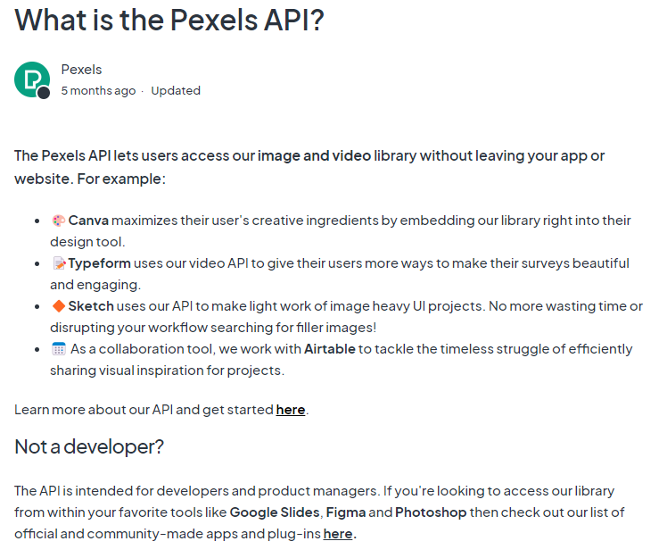
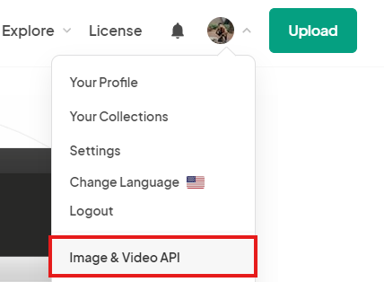
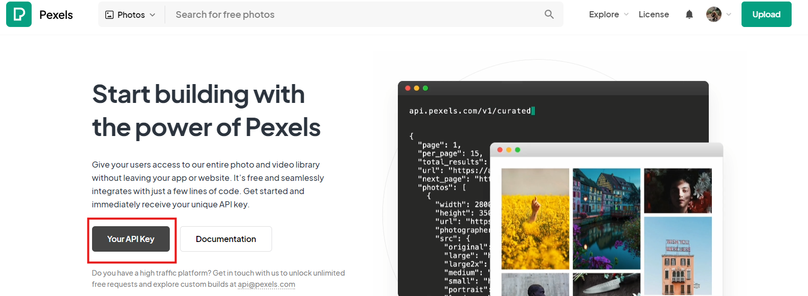

---

## II. Usage

#### [1. Retrieve API Key](#retrieve-api-instruction) and Clone Git Repo
```bash
git clone https://github.com/NolanMM/Automating-Image-Search-and-Download-with-the-Pexels-API-Module.git
```

#### 2. Configure the .env file

- Modify API_KEY value inside .env file

#### 3. Run Python Script

``` bash
pip install requests python-dotenv
python pexels_image_downloader.py
```

#### III. Retrieve API Instruction
##### 1. Retrieve the API key by clicking the link: https://www.pexels.com/login/
##### 2. Sign Up or Login to Pexels by the link above.
##### 3. Go to the profile and click the API tab like the image below.

##### 4. Retrieve the API key


---

## III. API Limitation
- Pexels API Limit **(Free)**
- **200 Requests** per **Hour** or,
- **20,000 Requests** per **Month**
- More information: [Pexels API Page](https://help.pexels.com/hc/en-us/categories/900001326143-API)
    